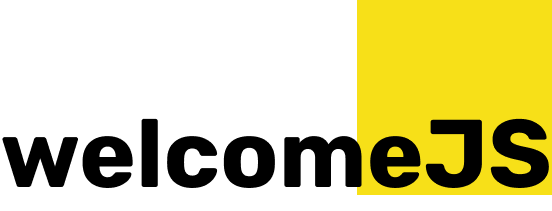

## Get Started

Welcome to the wonderful world of JavaScript! We hope you enjoy learning all about the language that makes up the web!

- [Beginners ⭐](#beginners)
- [Intermediate ⭐ ⭐](#intermediate)
- [Advanced ⭐ ⭐ ⭐](#advanced)
- [Contributing to Open Source](#contributing-to-open-source)
- [License](#license)
- [Discussions](https://github.com/edapm/welcomejs/discussions)

## Beginners
⭐

So you're started out in the JS world? You've come to the right place! Check out our links and tips below:

### Course Providers (Relevant to all three skill levels)

- [Udacity](https://udacity.com) - some good free and paid courses
- [Frontend Masters](https://frontendmasters.com) - great content from leading experts in the field
- [Codecademy](https://codecademy.com) - good step-by-step beginner courses, with an integrated enivronment to help you code with just your browser
- [w3Schools](https://w3schools.com) - free content and an IDE to try out code from the maintainers of the internet themselves

> **!Tip** Also check out the HTML/CSS courses, as these will become useful when you started building apps/websites.

### Books

- [Kyle Simpson's *You don't Know JS* series](https://github.com/getify/You-Dont-Know-JS) - A series of books to get you started with JS, published free on GitHub - need I say more?

## Intermediate
⭐⭐

After learning vanilla JavaScript, the next thing to learn about is frameworks. There are many, but the main four are Angular, React, Vue and Ember. 

> *Frontend Masters (mentioned above) has a really great React course by Brain Holt that I've personally done and can recommend - find it [here](https://frontendmasters.com/courses/complete-react-v5)*

### Framework Websites and Official Docs

- [Angular](https://angular.io) - a popular framework made by Google
- [React](https://reactjs.org) - smaller than Angular, a popular library built at Facebook
- [Vue](https://vuejs.org) - an alternative framework, very fast
- [Ember](https://emberjs.com) - a framework for "ambitious developers"

### Static Site Generators (SSGs)

Quickly build static sites from Markdown using a static site generator. Popular ones include Gatsby, Eleventy, Gridsome, Hugo and Jekyll.

- [Gatsby](https://gatsbyjs.com) - a React-based SSG, one of the most popular
- [Eleventy](https://11ty.dev) - a general JS-based SSG
- [Gridsome](https://gridsome.org) - a Vue- and API-based SSG

### Server Side Rendering

Frameworks such as Next and Nuxt which render pages server-side before sending them to the client

- [Next](https://nextjs.org) - a React-based framework
- [Nuxt](https://nuxtjs.org) - a Vue-based framework

### JAMStack Hosting Services

Quickly deploy static sites and apps

- [Netlify](https://netlify.com)
- [Vercel](https://vercel.com)
- [GitHub Pages](https://pages.github.com)
- [Firebase Hosting](https://firebase.google.com/products/hosting)

## Advanced
⭐⭐⭐

Continue learning the tools of the trade by building full-stack web apps, and then apply for a job!

### Full-Stack Development

If you want to built a full-stack web application in JavaScript, try these!

- [NodeJS](https://nodejs.org) - For server-side JavaScript
- [Go](https://golang.org) - Not strictly JavaScript, but a popular language to write APIs in

### API Services

Services to help you handle data and content without having to code a backend

- [Strapi](https://strapi.io)
- [Contentful](https://contentful.com)
- [Firebase](https://firebase.google.com)
- [Sanity](https://sanity.io)

### Helpful Job Prep Links

- [Udacity](https://udacity.com) - Mentioned before, has some good interview help videos
- [InterviewCake](https://www.interviewcake.com) - Programming interview question examples and guidance

## Contributing to Open Source

To get started with Open Source, the best thing is to know a bit (even if it's the smallest bit!) of JavaScript (or any language), and to be familiar with Git. Then you can signup for GitHub, and start contributing!

- Check out MunGell's list of good projects to contribute to - [here](https://github.com/MunGell/awesome-for-beginners#javascript)
- Or check out [First Contributions](https://github.com/firstcontributions/first-contributions)

---

- If you need to learn Git/GitHub, try Jessica Lord's [Git It!](https://github.com/jlord/git-it-electron)
- Or, head to Atlassian's website for their [guide](https://www.atlassian.com/git)
- And GitHub's docs are helpful as well - [here](https://docs.github.com)

## License & Thanks

&copy; 2020-2021 Ed Mason & Contributors - [License](https://github.com/edapm/welcomejs/blob/main/LICENSE)

### Thank Yous

- [Docsify](https://docsify.js.org) for the SSG which we use for our website
- [JS.org](https://js.org) for the free domain
- [npm](https://npmjs.com) for an awesome JavaScript package manager
- [GitHub](https://github.com) for the awesome code-hosting service
- The JS Community for just being awesome
- **YOU** for reading this! :-)
